<div align="center">
  <picture>
    <source media="(prefers-color-scheme: dark)" srcset="./profile/mark-dark.svg" />
    <source media="(prefers-color-scheme: light)" srcset="./profile/mark.svg" />
    
  </picture>
</div>

<br/>

<div align="center">
  <a href="https://daochau.com" target="_blank">
    
  </a>
  <a href="https://www.linkedin.com/in/dao-chau" target="_blank">
    
  </a>
  <a href="https://www.youtube.com/@daomapsieusieucap" target="_blank">
    
  </a>
  <a href="mailto:bichdao.chau@gmail.com" target="_blank">
    
  </a>
</div>

<br/>

<div align="center">
  
</div>

<br/>

<h2 align="center">dao chau · backend developer</h2>

<div align="center">

```
$ whoami
working at ViiVue · based in Saigon · powered by cà phê sữa đá
```

</div>

<br/>

<h3 align="center">tools</h3>

<div align="center">
  
  
  
  
  
  
  
  
  
</div>

<br/>

<h3 align="center">stats</h3>

<div align="center">
  <picture>
    <source media="(prefers-color-scheme: dark)" srcset="./profile/stats-dark.svg" />
    <source media="(prefers-color-scheme: light)" srcset="./profile/stats-light.svg" />
    
  </picture>
</div>
